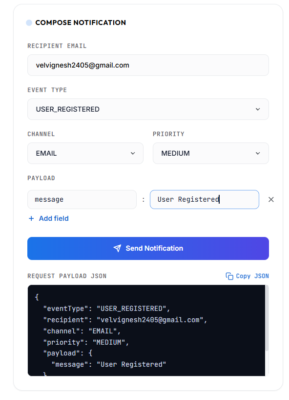
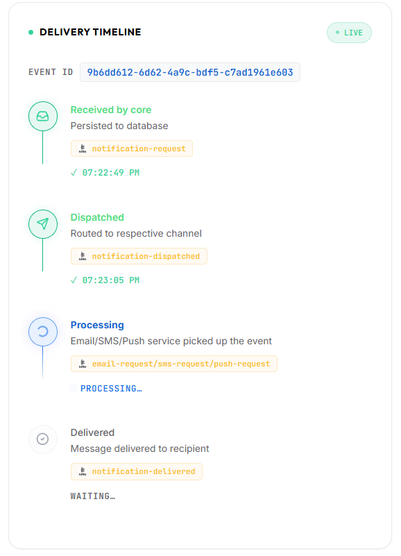
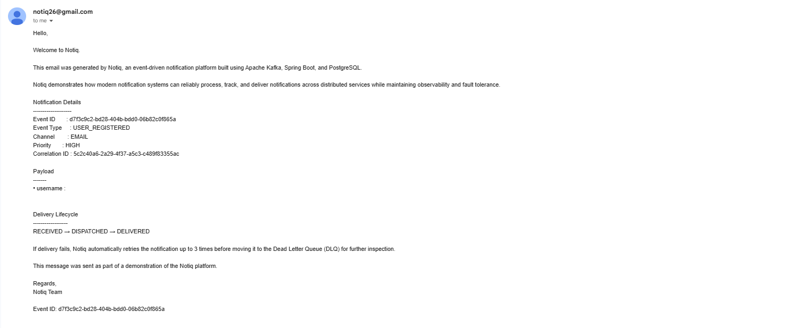
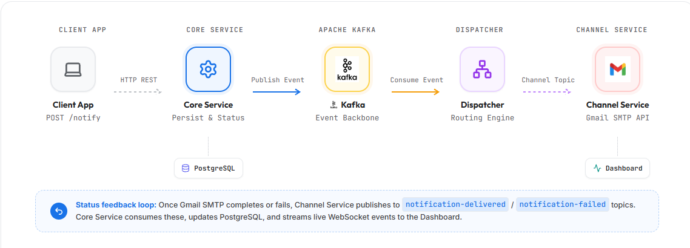
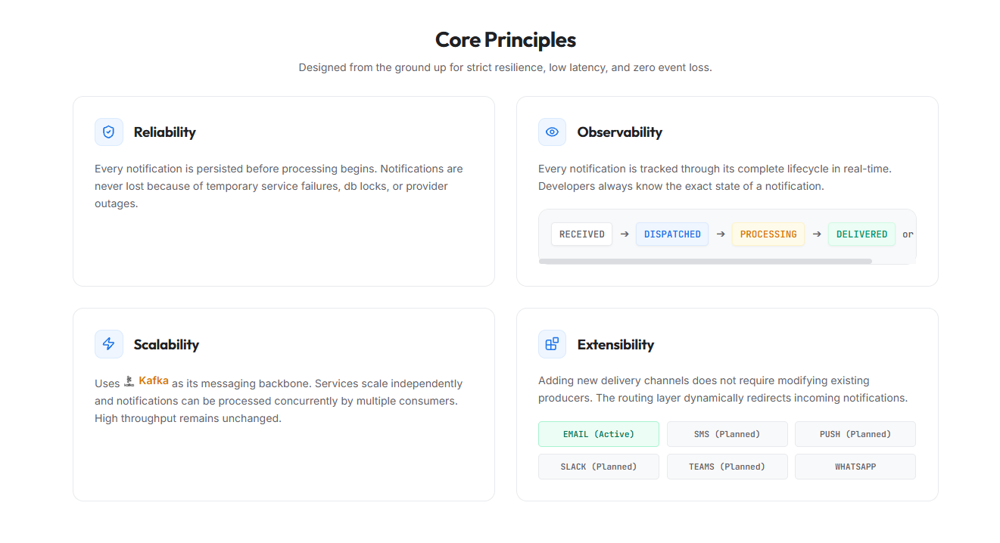

# Notiq - Event-Driven Notification Platform


## Overview

Notiq is a distributed event-driven notification platform built using Spring Boot microservices, Apache Kafka, PostgreSQL, Docker, and AWS.

The platform enables reliable notification delivery through asynchronous messaging, retry mechanisms, dead-letter queues, and real-time status tracking using Server-Sent Events (SSE).

The project demonstrates production-grade backend engineering concepts including event-driven architecture, distributed systems, fault tolerance, microservices communication, and cloud deployment.

---

## Live Demo

Frontend: https://notiq-ui.vercel.app

Backend API: https://notiq.duckdns.org

---

## Screenshots

### Notification Creation



---

### Real-Time Status Tracking



---

### Email Delivery



---

### System Architecture



---

### Core Principles 



---

## Features

### Event-Driven Architecture

- Fully asynchronous notification processing
- Loose coupling between services
- Kafka-based communication
- Independent service deployment

### Real-Time Status Tracking

Track notification lifecycle in real time:

- RECEIVED
- DISPATCHED
- PROCESSING
- DELIVERED
- FAILED
- DLQ

### Retry Mechanism

- Automatic retries for transient failures
- Configurable retry attempts
- Failure tracking
- Event republishing

### Dead Letter Queue (DLQ)

Failed notifications that exceed retry limits are moved to a dedicated DLQ topic for further investigation.

### Server-Sent Events (SSE)

Live frontend updates without polling.

### Idempotency Protection

Duplicate events are automatically detected and ignored.

### Persistent Storage

All notifications are stored in PostgreSQL for:

- Auditing
- Tracking
- Analytics
- Debugging

---

## Architecture

```text
Frontend (React)
        |
        v
Core Service
        |
        v
Kafka (notification-request)
        |
        v
Dispatcher Service
        |
        v
Kafka (email-notifications)
        |
        v
Email Service
        |
        v
Kafka (notification-status)
        |
        v
Core Service
        |
        v
Server-Sent Events (SSE)
        |
        v
Frontend
```

---

## Microservices

### Core Service

Responsibilities:

- Receive notification requests
- Persist notifications
- Maintain notification state
- Consume status updates
- Publish SSE updates
- Handle retry and DLQ workflows

---

### Dispatcher Service

Responsibilities:

- Consume notification requests
- Route notifications to appropriate channels
- Publish DISPATCHED status events

---

### Email Service

Responsibilities:

- Send emails
- Publish PROCESSING events
- Publish DELIVERED events
- Publish FAILED events

---

## Kafka Topics

| Topic | Purpose |
|---------|----------|
| notification-request | Notification ingestion |
| email-notifications | Email routing |
| notification-status | Unified status tracking |
| notification-retry | Retry processing |
| notification-dlq | Dead letter queue |

---

## Tech Stack

### Backend

- Java 21
- Spring Boot
- Spring Data JPA
- Hibernate
- Spring Kafka

### Messaging

- Apache Kafka
- Aiven Kafka

### Database

- PostgreSQL
- Neon Database

### Frontend

- React
- Vite
- Bootstrap

### Real-Time Communication

- Server-Sent Events (SSE)

### Infrastructure

- Docker
- AWS EC2
- Nginx
- HTTPS

---

## Notification Lifecycle

```text
RECEIVED
    ↓
DISPATCHED
    ↓
PROCESSING
    ↓
DELIVERED
```

Failure Flow:

```text
PROCESSING
    ↓
FAILED
    ↓
RETRY
    ↓
FAILED
    ↓
DLQ
```

---

## API Example

### Create Notification

```http
POST /notifications
```

Request:

```json
{
  "recipient": "user@example.com",
  "channel": "EMAIL",
  "priority": "HIGH",
  "payload": {
    "subject": "Welcome",
    "message": "Hello from Notiq"
  }
}
```

Response:

```json
{
  "eventId": "123e4567-e89b-12d3-a456-426614174000"
}
```

---

### Get Notification Status

```http
GET /notifications/{eventId}
```

Response:

```json
{
  "eventId": "123e4567-e89b-12d3-a456-426614174000",
  "status": "DELIVERED"
}
```

---

## Deployment

### Infrastructure

- AWS EC2
- Docker Containers
- Nginx Reverse Proxy
- Neon PostgreSQL
- Aiven Kafka

### Deployment Workflow

```text
Code
 ↓
Docker Build
 ↓
Docker Hub
 ↓
AWS EC2
 ↓
Nginx
 ↓
Production
```

---

## Reliability Features

### Event Deduplication

Duplicate events are automatically ignored using unique Event IDs.

### Retry Processing

Transient failures are retried automatically.

### Dead Letter Queue

Failed messages are isolated for later inspection.

### Asynchronous Processing

Kafka prevents service blocking and improves fault tolerance.

---
## For More Details about the backend endpoints read the developer docs in the demo
https://notiq-ui.vercel.app

## Future Improvements

- SMS Notifications
- Push Notifications
- User Authentication
- Notification Templates
- Analytics Dashboard
- Monitoring and Metrics
- Multi-Channel Routing
- Rate Limiting

---

## Learning Outcomes

This project helped explore:

- Event-Driven Architecture
- Distributed Systems
- Microservices Design
- Apache Kafka
- Retry & DLQ Patterns
- Server-Sent Events
- Docker
- AWS Deployment
- Production Infrastructure
- Cloud-Native Development

---

## Author

**Vel Vignesh**

B.Tech Information Technology  
Sri Krishna College of Engineering and Technology

LinkedIn: https://www.linkedin.com/in/vel-vignesh-92a003330/